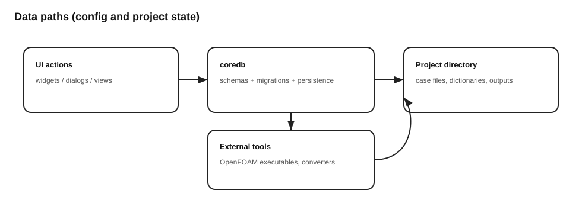

# Architecture

## Runtime layers
- **UI layer**: PySide6 (Qt) widgets, windows, dialogs
- **Domain layer**: case setup, configuration, and orchestration
- **Integration layer**: OpenFOAM tooling, file formats, external executables

## Data / config
- `coredb/` is used to store and migrate app configuration/state.

